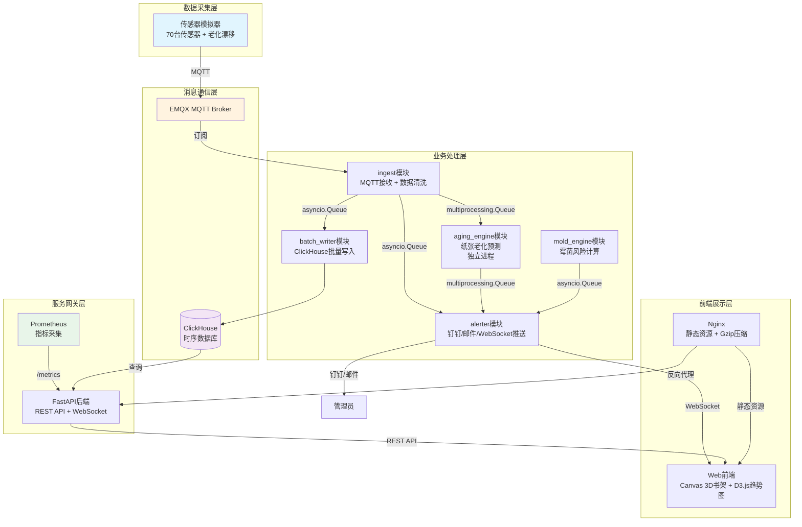
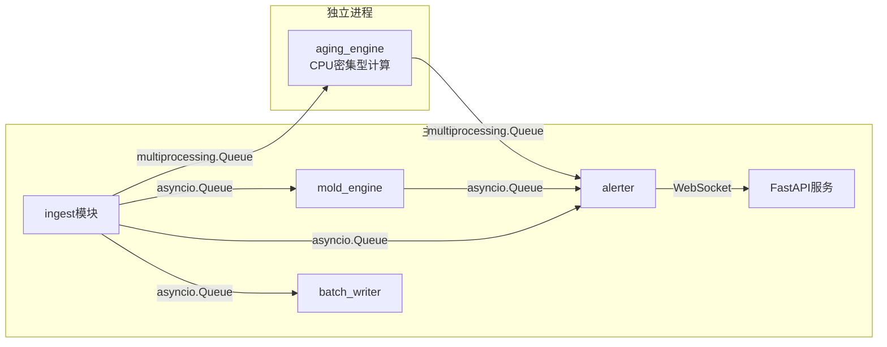

# 古代医学文献馆藏微环境监测与古籍病害预测系统

基于物联网和AI算法的古籍保护监测系统，用于历史医学文献博物馆的古籍微环境监测和病害预测。

## 系统架构



## 目录结构

```
├── backend/                    # 后端代码
│   ├── app/
│   │   ├── algorithms/         # 核心算法
│   │   │   ├── arrhenius.py    # 纸张老化动力学模型
│   │   │   └── mold_growth.py  # 霉菌生长模型
│   │   ├── alerts/             # 告警管理
│   │   ├── ingest/             # 数据摄取模块
│   │   ├── batch_writer/       # 批量写入模块
│   │   ├── aging_engine/       # 老化预测引擎（独立进程）
│   │   ├── mold_engine/        # 霉菌风险计算引擎
│   │   ├── alerter/            # 告警推送模块
│   │   ├── core/               # 核心组件
│   │   │   ├── config.py       # 配置管理
│   │   │   ├── logging_setup.py # loguru日志配置
│   │   │   ├── metrics.py      # Prometheus指标
│   │   │   ├── queue_manager.py# 队列管理器
│   │   │   └── messages.py     # 消息协议
│   │   ├── knowledge/          # 知识图谱
│   │   ├── routers/            # API路由
│   │   └── main.py             # 应用入口
│   ├── simulator/
│   │   └── sensor_simulator.py # 传感器模拟器
│   ├── tests/                  # 单元测试
│   ├── requirements.txt        # Python依赖
│   ├── config.yaml             # 系统配置
│   ├── Dockerfile              # 后端Dockerfile
│   └── run.py                  # 启动脚本
├── clickhouse/
│   └── init.sql                # 数据库初始化脚本
├── frontend/                   # 前端代码
│   ├── index.html              # 主页面
│   ├── css/
│   └── js/
│       ├── Shelf3DView.js       # Canvas三维书架组件
│       ├── HeatmapLayer.js     # 热力图叠加层
│       ├── TrendPanel.js      # D3.js趋势面板
│       └── app.js              # 主应用
├── nginx/                      # Nginx配置
│   ├── nginx.conf
│   └── conf.d/
│       └── default.conf
├── prometheus/
│   └── prometheus.yml          # Prometheus配置
├── docker-compose.yml          # Docker编排
└── README.md
```

## 核心功能

### 1. 微环境监测
- 支持最多70+台环境传感器（温湿度、光照、VOC、霉菌孢子浓度）
- pH值检测仪
- MQTT协议数据上报
- ClickHouse时序数据存储，按月分区，原始数据保留2年

### 2. 核心算法
- **纸张老化动力学模型**：基于Arrhenius方程，计算pH下降速率和老化指数
- **霉菌生长模型**：基于温度和相对湿度的响应函数，预测霉菌生长风险

### 3. 告警系统
- **黄色告警**：pH<6.5 或 霉菌孢子>500 CFU/m³
- **橙色告警**：pH<6.0 或 光照>50 lux
- **红色告警**：pH<5.5 或 检测到活性霉菌
- 推送方式：钉钉机器人、邮件、WebSocket

### 4. 三维可视化
- Canvas绘制三维书架模型，使用requestAnimationFrame限帧
- 病害区域热力图标注（酸化、霉变、虫蛀）
- 点击格口查看近3个月微环境趋势
- 纸张老化速率预测曲线

### 5. 知识图谱
- 古代防蠹药方推荐（芸草、黄柏等）
- 病害与古籍关联
- 传统防治方法查询

## 快速部署

### 环境要求
- Docker 20.10+
- Docker Compose v2+

### 一键部署

```bash
docker-compose up -d
```

### 服务访问地址

| 服务 | 地址 | 说明 |
|------|------|------|
| 前端 | http://localhost | Nginx静态页面 |
| 后端API | http://localhost/api | FastAPI接口 |
| API文档 | http://localhost/docs | Swagger UI |
| Redoc文档 | http://localhost/redoc | ReDoc文档 |
| Prometheus | http://localhost:9090 | 指标监控 |
| EMQX控制台 | http://localhost:18083 | MQTT管理控制台 |
| EMQX MQTT | mqtt://localhost:1883 | MQTT Broker |
| ClickHouse | http://localhost:8123 | HTTP接口 |

### 服务启停

```bash
# 启动所有服务
docker-compose up -d

# 查看服务状态
docker-compose ps

# 查看日志
docker-compose logs -f backend

# 停止所有服务
docker-compose down

# 停止并删除数据卷
docker-compose down -v
```

### 单独启动特定服务

```bash
# 只启动后端和数据库
docker-compose up -d backend clickhouse

# 重启模拟器
docker-compose restart simulator
```

## 传感器模拟器

### 功能特性
- 支持自定义传感器数量
- 支持极端温湿度模式
- 支持传感器老化漂移模拟
- 支持生成历史数据

### 命令行参数

```bash
python -m simulator.sensor_simulator --help
```

| 参数 | 环境变量 | 默认值 | 说明 |
|------|----------|--------|------|
| `--broker` | `MQTT_BROKER` | localhost | MQTT Broker地址 |
| `--port` | `MQTT_PORT` | 1883 | MQTT端口 |
| `--username` | `MQTT_USERNAME` | - | MQTT用户名 |
| `--password` | `MQTT_PASSWORD` | - | MQTT密码 |
| `--sensors` | `SENSOR_COUNT` | 70 | 总传感器数量 |
| `--ph-ratio` | - | 0.3 | pH传感器占比 |
| `--interval` | `REPORT_INTERVAL` | 300 | 上报间隔（秒） |
| `--extreme` | `EXTREME_MODE` | false | 启用极端温湿度模式 |
| `--no-drift` | - | - | 禁用老化漂移 |
| `--drift-rate` | `DRIFT_RATE` | 0.001 | 漂移速率 |
| `--once` | - | - | 只运行一次 |
| `--history` | - | 0 | 生成历史数据天数 |
| `--output` | - | - | 历史数据输出文件 |
| `--summary` | - | - | 显示配置摘要 |

### 使用示例

```bash
# 默认配置查看
python -m simulator.sensor_simulator --summary

# 70台传感器，5分钟上报一次
python -m simulator.sensor_simulator --sensors 70 --interval 300

# 极端模式，100台传感器，1分钟上报
python -m simulator.sensor_simulator --sensors 100 --interval 60 --extreme

# 生成30天历史数据
python -m simulator.sensor_simulator --history 30 --output history.json

# 禁用漂移
python -m simulator.sensor_simulator --no-drift
```

### Docker中使用

```yaml
simulator:
  environment:
    - SENSOR_COUNT=70
    - REPORT_INTERVAL=300
    - EXTREME_MODE=false
    - DRIFT_ENABLED=true
    - DRIFT_RATE=0.001
```

## 配置说明

### 主配置文件

配置文件：`backend/config.yaml`

主要配置段：

- `service` - 服务基本配置
- `clickhouse` - ClickHouse数据库配置
- `mqtt` - MQTT连接配置
- `batch_writer` - 批量写入配置
- `aging_engine` - 老化引擎配置
- `mold_engine` - 霉菌引擎配置
- `algorithms` - 算法参数（Arrhenius、霉菌生长）
- `alerts` - 告警阈值
- `notification` - 通知配置（钉钉、邮件）
- `shelf_layout` - 书架布局
- `data_validation` - 数据验证范围

### 环境变量

部分配置支持通过环境变量覆盖：

| 环境变量 | 说明 |
|----------|------|
| `CLICKHOUSE_HOST` | ClickHouse主机地址 |
| `CLICKHOUSE_PORT` | ClickHouse端口 |
| `CLICKHOUSE_USER` | ClickHouse用户名 |
| `CLICKHOUSE_PASSWORD` | ClickHouse密码 |
| `MQTT_BROKER` | MQTT Broker地址 |
| `MQTT_PORT` | MQTT端口 |
| `MQTT_USERNAME` | MQTT用户名 |
| `MQTT_PASSWORD` | MQTT密码 |
| `DINGTALK_WEBHOOK` | 钉钉机器人Webhook |
| `SMTP_HOST` | SMTP服务器地址 |
| `SMTP_PORT` | SMTP端口 |
| `SMTP_USER` | SMTP用户名 |
| `SMTP_PASSWORD` | SMTP密码 |
| `LOG_LEVEL` | 日志级别 |
| `LOG_JSON` | 是否输出JSON格式日志 |
| `CONFIG_PATH` | 配置文件路径 |

## API文档

启动后端后访问自动生成的API文档：

- **Swagger UI**: http://localhost/docs
- **ReDoc**: http://localhost/redoc
- **OpenAPI JSON**: http://localhost/openapi.json

### 主要API接口

#### 系统接口

| 方法 | 路径 | 说明 |
|------|------|------|
| GET | `/` | 根路径，服务信息 |
| GET | `/health` | 健康检查 |
| GET | `/metrics` | Prometheus指标 |
| GET | `/api/status` | 系统状态和统计 |
| GET | `/api/queue_stats` | 队列统计信息 |

#### 配置接口

| 方法 | 路径 | 说明 |
|------|------|------|
| GET | `/api/config/shelf_layout` | 获取书架布局配置 |
| GET | `/api/config/alert_thresholds` | 获取告警阈值配置 |
| GET | `/api/config/paper_types` | 获取纸张类型配置 |

#### 监测接口

| 方法 | 路径 | 说明 |
|------|------|------|
| GET | `/api/monitor/shelves` | 获取书架列表 |
| GET | `/api/monitor/shelf/{shelf_id}` | 获取书架详情 |
| GET | `/api/monitor/slot/{shelf_id}/{slot_id}` | 获取格口详情 |
| GET | `/api/monitor/env/recent` | 获取最近环境数据 |
| GET | `/api/monitor/ph/recent` | 获取最近pH数据 |
| GET | `/api/monitor/alerts` | 获取告警列表 |
| GET | `/api/monitor/alerts/recent` | 获取最近告警 |

#### 分析接口

| 方法 | 路径 | 说明 |
|------|------|------|
| POST | `/api/predict/aging` | 提交老化预测请求 |
| POST | `/api/predict/mold` | 提交霉菌预测请求 |
| GET | `/api/analysis/aging/{shelf_id}` | 获取老化分析结果 |
| GET | `/api/analysis/mold/{shelf_id}` | 获取霉菌分析结果 |

#### 知识接口

| 方法 | 路径 | 说明 |
|------|------|------|
| GET | `/api/knowledge/diseases` | 获取病害知识列表 |
| GET | `/api/knowledge/disease/{type}` | 获取特定病害知识 |
| GET | `/api/knowledge/herbs` | 获取药材列表 |
| GET | `/api/knowledge/prescriptions` | 获取药方列表 |

#### WebSocket接口

| 路径 | 说明 |
|------|------|
| `/ws/alert` | 告警实时推送 |

#### 测试接口

| 方法 | 路径 | 说明 |
|------|------|------|
| POST | `/api/test/alert` | 测试告警推送 |

### WebSocket告警推送

连接后自动接收最新告警推送：

```javascript
const ws = new WebSocket('ws://localhost/ws/alert');

ws.onmessage = function(event) {
    const data = JSON.parse(event.data);
    if (data.type === 'alert') {
        console.log('收到告警:', data.data);
    }
};

// 发送心跳
ws.send(JSON.stringify({ type: 'ping' }));
```

## 监控指标

系统通过Prometheus暴露监控指标，访问 `/metrics` 端点。

### 主要指标

| 指标名称 | 类型 | 说明 |
|----------|------|------|
| `ingest_messages_total` | Counter | 摄取消息总数 |
| `ingest_errors_total` | Counter | 摄取错误总数 |
| `queue_length` | Gauge | 队列当前长度 |
| `queue_dropped_total` | Counter | 队列丢弃消息总数 |
| `batch_writer_batch_size` | Histogram | 批写入批次大小 |
| `batch_writer_flushes_total` | Counter | 批次刷新总数 |
| `batch_writer_write_duration_seconds` | Histogram | 写入操作耗时 |
| `aging_engine_predictions_total` | Counter | 老化预测总数 |
| `aging_engine_duration_seconds` | Histogram | 老化预测耗时 |
| `mold_engine_calculations_total` | Counter | 霉菌计算总数 |
| `alerts_total` | Counter | 告警总数 |
| `alerts_deduped_total` | Counter | 去重告警数 |
| `websocket_connections` | Gauge | WebSocket连接数 |
| `api_requests_total` | Counter | API请求总数 |
| `api_request_duration_seconds` | Histogram | API请求耗时 |
| `clickhouse_connected` | Gauge | ClickHouse连接状态 |
| `mqtt_connected` | Gauge | MQTT连接状态 |
| `system_running` | Gauge | 系统运行状态 |

### Prometheus配置

配置文件：`prometheus/prometheus.yml`

默认采集目标：
- backend:8000 - 后端应用指标
- clickhouse:9363 - ClickHouse指标
- emqx:18083 - EMQX指标

## 日志系统

使用loguru输出JSON格式日志到stdout。

### 日志格式

```json
{
  "timestamp": "2024-01-15T10:30:00.123Z",
  "level": "INFO",
  "service": "古代医学文献馆藏微环境监测系统",
  "message": "系统启动完成",
  "module": "main",
  "function": "lifespan",
  "line": 123,
  "process": 12345,
  "thread": 12345
}
```

### 日志级别

- `DEBUG` - 调试信息
- `INFO` - 一般信息
- `WARNING` - 警告信息
- `ERROR` - 错误信息
- `CRITICAL` - 严重错误

### 配置

通过环境变量`LOG_JSON`控制是否输出JSON格式，生产环境建议开启。

## ClickHouse配置

### 数据表

| 表名 | 说明 | 分区 | TTL |
|------|------|------|-----|
| `env_sensor_data` | 环境传感器数据 | 按月 | 2年 |
| `ph_sensor_data` | pH传感器数据 | 按月 | 2年 |
| `alerts` | 告警记录 | 按月 | 1年 |
| `aging_prediction` | 老化预测结果 | 按月 | 6个月 |
| `books_info` | 古籍基本信息 | - | - |
| `disease_knowledge_graph` | 病害知识图谱 | - | - |

### 物化视图

| 视图名 | 说明 | 粒度 |
|--------|------|------|
| `env_hourly_mv` | 环境数据小时聚合 | 每小时 |
| `ph_hourly_mv` | pH数据小时聚合 | 每小时 |
| `ph_daily_mv` | pH数据日聚合 | 每天 |

### 数据保留策略

- 原始环境数据：保留2年，按月分区
- 告警记录：保留1年
- 老化预测：保留6个月

## 模块通信机制

### 队列通信架构



### 队列类型

| 队列类型 | 适用场景 | 特点 |
|----------|----------|------|
| `asyncio.Queue` | 同进程异步通信 | 高性能、低开销 |
| `multiprocessing.Queue` | 跨进程通信 | 进程隔离、适合CPU密集型 |

### 核心队列

| 队列名称 | 类型 | 说明 |
|----------|------|------|
| sensor_data | asyncio | 传感器数据队列 |
| alert_data | asyncio | 告警数据队列 |
| aging_request | multiprocessing | 老化预测请求队列 |
| aging_result | multiprocessing | 老化预测结果队列 |

## 前端组件

### Shelf3DView.js
Canvas三维书架可视化组件
- 支持旋转、缩放、平移
- requestAnimationFrame限帧渲染
- 背景缓存优化

### HeatmapLayer.js
病害热力图叠加层组件
- 支持pH、霉菌、酸化、虫害等多种热力类型
- 渐变色彩映射

### TrendPanel.js
D3.js曲线趋势面板组件
- 温度、湿度、霉菌孢子等多参数曲线
- 支持缩放、平移交互

## 开发指南

### 本地开发

```bash
cd backend
pip install -r requirements.txt
python run.py
```

### 运行测试

```bash
cd backend
pytest tests/ -v
```

### 构建镜像

```bash
cd backend
docker build -t ancient-books-backend .
```

## 告警分级

| 级别 | pH阈值 | 霉菌孢子 | 光照 | 推送方式 |
|------|--------|----------|------|----------|
| 黄 | <6.5 | >500 CFU/m³ | - | 钉钉提醒 |
| 橙 | <6.0 | - | >50 lux | 钉钉+邮件 |
| 红 | <5.5 | 活性霉菌 | - | 钉钉@所有人+邮件 |

## 病害知识图谱

- **酸化**：黄柏染纸法、石灰水脱酸法
- **霉变**：芸香避蠹法、苍术熏库法
- **虫蛀**：芸草藏书法、雄黄熏书法、苦楝纸法
- **光老化**：槐花染纸防光法、五倍子固色法
- **潮湿**：石灰除湿法、木炭吸潮法

## License

MIT License
